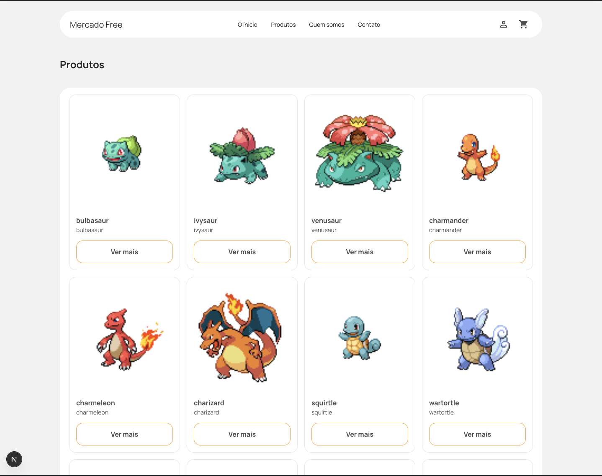
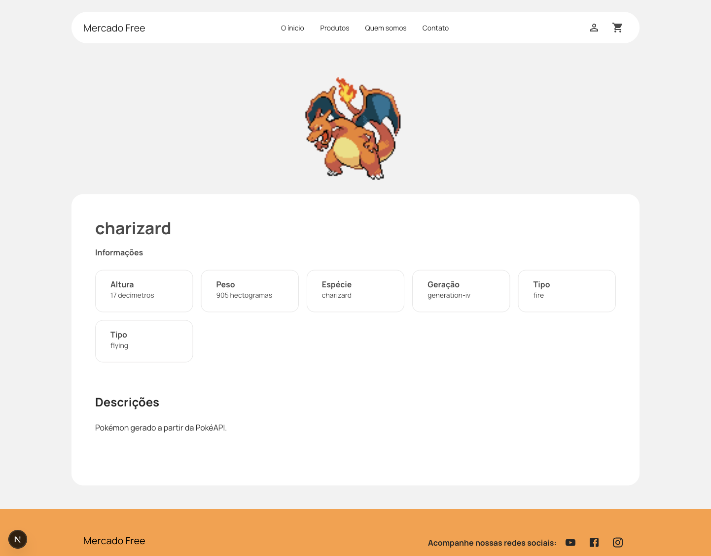

# 🛍️ Next.js Mercado Free

Aplicação de vitrine de produtos com detalhe individual de cada produto, desenvolvida com:

- ✅ [Next.js 14 (App Router)](https://nextjs.org/docs)
- ✅ [Material UI (v5)](https://mui.com/)
- ✅ [React Query (TanStack Query v5)](https://tanstack.com/query/latest)
- ✅ Seguir o layout do figma: https://www.figma.com/design/hvEZlSOvroqgAbuO3PMhKQ/Teste-Dev-Front-End---Seminovos?node-id=0-1&p=f&t=M2TiYL2R52bYQb6l-0
- ✅ Arquitetura em camadas com princípios SOLID
- Foi utilizada a api pública de pokemons
- Projeto pode ser acessado no link: https://mercado-free-eight.vercel.app/

# Preview do projeto




# Instale as dependências

yarn install

# Rode o servidor de desenvolvimento

```bash
npm run dev
# or
yarn dev
# or
pnpm dev
# or
bun dev
```

## Deploy Vercel

- Projeto pode ser acessado no link: https://mercado-free-eight.vercel.app/
